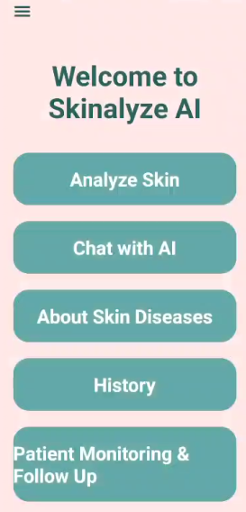
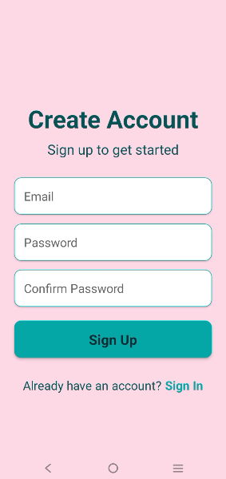
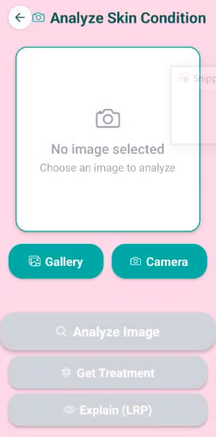
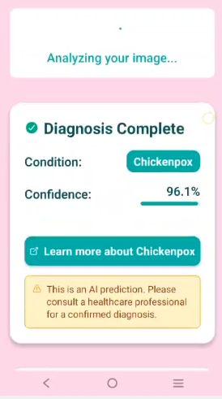
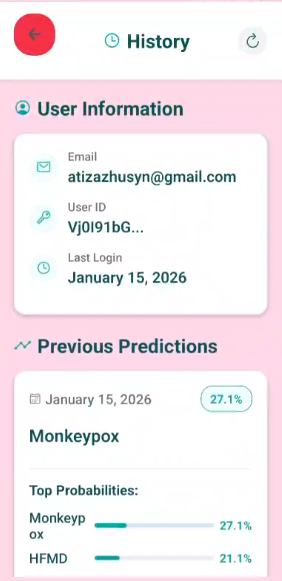
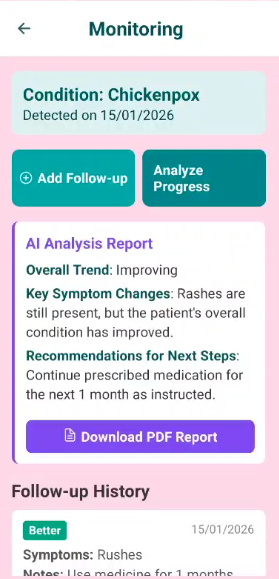
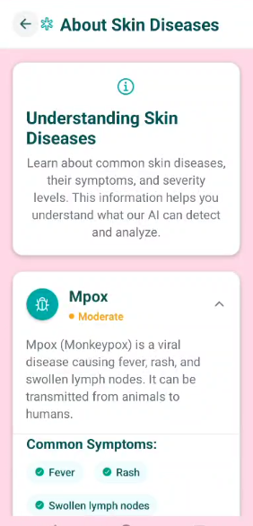
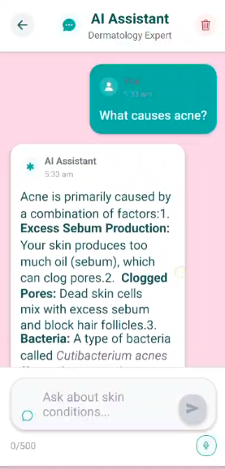
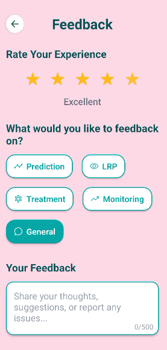

# Skinalyze AI

Skinalyze AI helps identify skin conditions from a photo, then explains the result, suggests treatment information, and tracks follow-up.

## See it working

### Home

### Sign up

### Analyze a photo

### Prediction

### History

### Monitoring

### About skin diseases

### AI assistant

### Feedback

## Project layout

- `Main_Frontend` is the mobile app
- `Backend_server` is the analysis API

Setup steps for the app are in [Main_Frontend/README.md](Main_Frontend/README.md).
